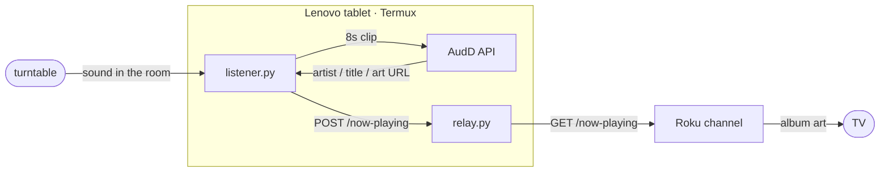

# now-playing-vinyl

Show the album art of whatever record is on the turntable, fullscreen on
the TV.

There's no smart anything in the signal chain — just a turntable and an
amp. So a tablet near the speakers listens to the room, identifies the
track, and a sideloaded Roku channel puts the cover art on the screen.




## How it works

1. **[tablet-listener/](tablet-listener)** records a short mic clip every
   couple of minutes and sends it to [AudD](https://audd.io) for music
   recognition. It pulls artist / title / album and an album-art URL
   (Apple Music, falling back to Spotify then Deezer) out of the
   response and POSTs that to the relay. It only posts when the track
   changes, and clears the relay after a few misses so the screen goes
   dark when the music stops.
2. **[relay/](relay)** is a tiny HTTP server holding one "currently
   playing" record. The listener POSTs to it, the Roku GETs from it. It
   mirrors the record to a file so a restart doesn't blank the TV.
3. **[roku-channel/](roku-channel)** is a BrightScript / SceneGraph app
   sideloaded onto the Roku Express. A background task polls
   `GET /now-playing`; the scene shows the album art fullscreen (square,
   centered on black) or a status message when nothing's playing.

The listener and relay both run on the tablet under Termux, so the only
always-on device is the tablet itself — no Pi, no cloud.

Both Python pieces are **standard library only** (no `pip`), so they run
under the Python that ships with Termux.

## Relay API

| | |
|---|---|
| `GET /now-playing` | latest record, or `{}` when nothing is playing |
| `POST /now-playing` | store a record (JSON body) |
| `POST /now-playing` with `{}` or `{"clear": true}` | clear it |
| `GET /health` | `{"ok": true}` |

Record shape:

```json
{
  "artist": "Miles Davis",
  "title": "So What",
  "album": "Kind of Blue",
  "artUrl": "https://.../1000x1000.jpg",
  "source": "audd",
  "updatedAt": 1788923877
}
```

Unknown fields on POST are dropped; `updatedAt` (unix seconds) is stamped
by the server. POST is optionally protected by a bearer token
(`RELAY_TOKEN`).

## Getting it running

### On the tablet (Termux)

```bash
pkg install python termux-api        # also install the Termux:API app from F-Droid
git clone https://github.com/Mikehawk360/now-playing-vinyl
cd now-playing-vinyl

# relay
python3 relay/relay.py &

# listener
cp tablet-listener/.env.example tablet-listener/.env
$EDITOR tablet-listener/.env         # add your AUDD_TOKEN
python3 tablet-listener/listener.py
```

Grant the Termux:API app microphone permission, and keep the tablet
plugged in (wired only — it has no wireless charging). See
[tablet-listener/README.md](tablet-listener/README.md) for config and
running it as a service.

### On the Roku

Developer Mode must be enabled ([Roku
instructions](https://developer.roku.com/docs/developer-program/getting-started/developer-setup.md)).

```bash
# set relay_url in roku-channel/manifest to the tablet's LAN IP first
powershell -File roku-channel/package.ps1
```

Then open `http://<roku-ip>/` (user `rokudev`), upload
`roku-channel/now-playing-vinyl.zip`, and click **Replace**. Details in
[roku-channel/README.md](roku-channel/README.md).

## Status

| Piece | State |
|---|---|
| `relay/` | built, 7 unit tests passing |
| `tablet-listener/` | built, 9 unit tests passing, end-to-end POST→relay verified |
| `roku-channel/` | code-complete, XML validated — not yet run on hardware |
| Deployment | pending: sideload v0.2, set up Termux on the tablet, test with a record playing |

## Development

Tests are stdlib `unittest`, no dependencies:

```bash
cd relay && python3 -m unittest
cd tablet-listener && python3 -m unittest
```

The BrightScript can't be tested off-device; `telnet <roku-ip> 8085`
streams its debug console while the channel runs.

## Hardware

- **Roku Express** — Developer Mode on, sideloading confirmed working.
- **Lenovo TB3-850F** — 2 GB RAM, Android, wired charging only. Runs the
  listener + relay via Termux, left plugged in near the turntable.
